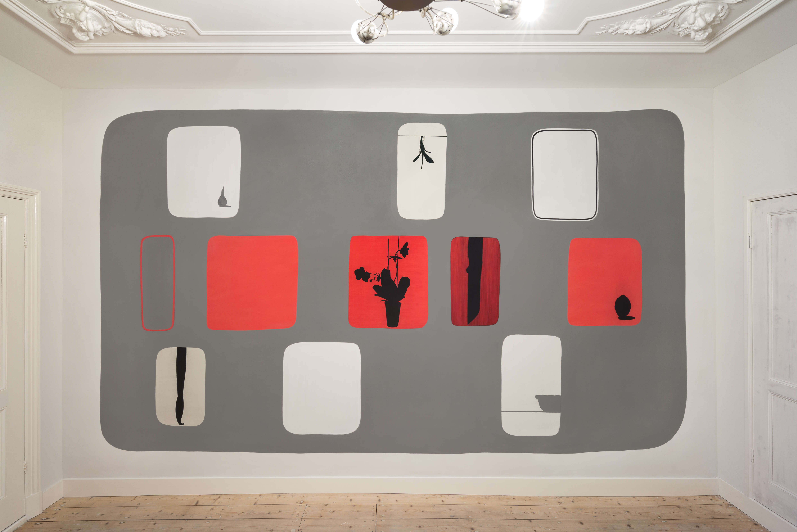
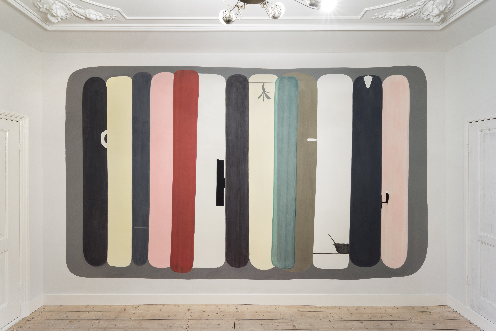
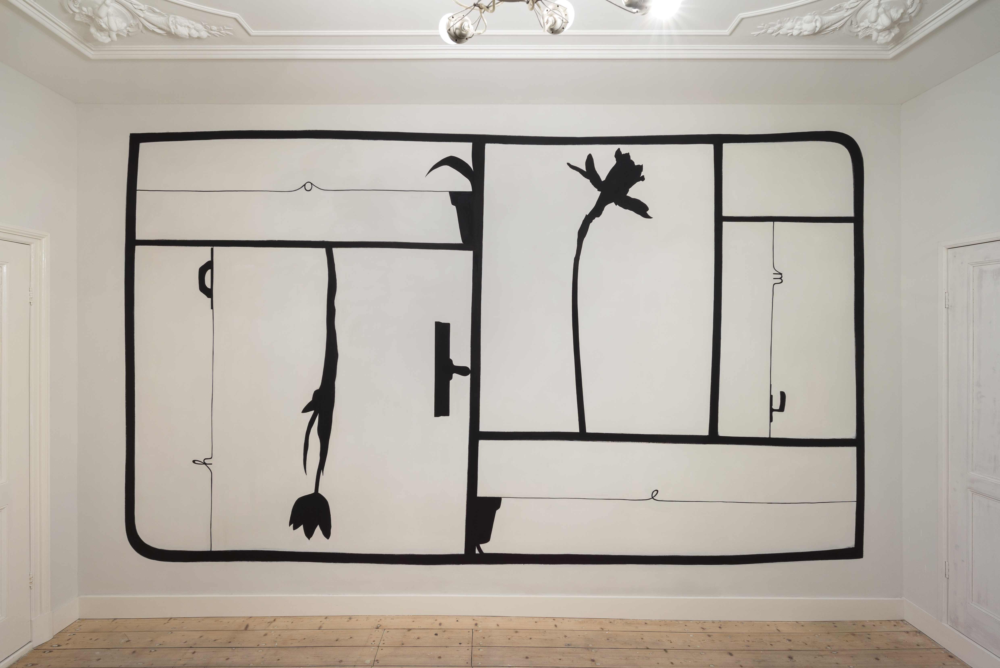
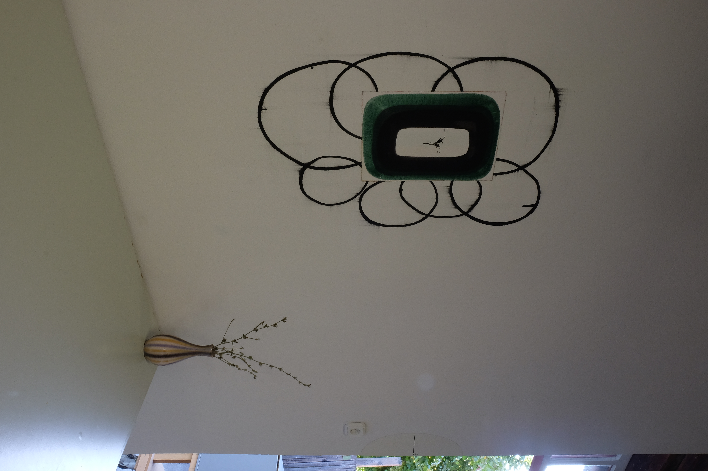
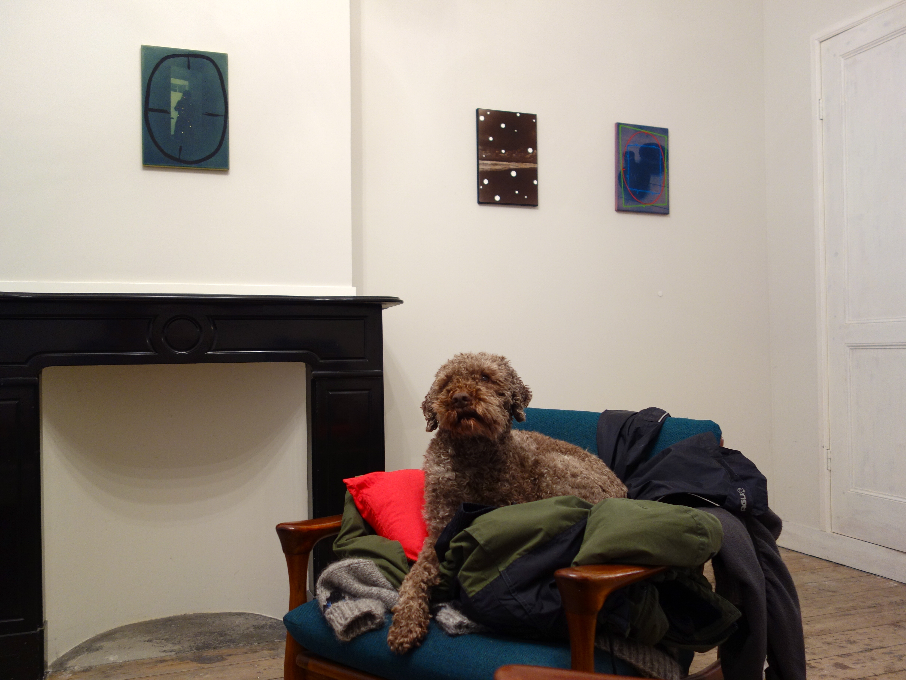

~~~Python
cid = 'Michel Hoogervorst'

doc.lib['footer'] = "Footer of the page. Footer of the page. Footer of the page. Footer of the page. Footer of the page. Footer of the page."

doc.title = doc.name = 'Michel&nbsp;Hoogervorst'
page = doc[1]
box = page.deepFind('Logo')
~~~
# Home

~~~Python
box = page.deepFind('Introduction')
~~~
## Three current projects

### [Guess things happen that way](projects.html) 

#### Previous project (ended Feb 2017) 

### [OTTHON Leszek](projects.html) Previous project (ended March 2017) 

### [Cash in studio](projects.html) Permanent project 

~~~Python
box = page.deepFind('HeroSlides').newSlide()
~~~

~~~Python
box = page.deepFind('HeroSlides').newSlide()
~~~

~~~Python
box = page.deepFind('HeroSlides').newSlide()
~~~

~~~Python
box = page.deepFind('Content')
~~~

# Repeat to improve

What makes a design process *fundamentally* different from a production process, is that repetition improves the result. Starting with quick sketches, ignoring most details, next steps take more time. It’s not a linear process, it’s an iterative process, which means repeating the previous step in more detail.

~~~Python
box = page.deepFind('ColoredSectionHeader')
~~~
# Some things in rows of 3 columns

~~~Python
box = page.deepFind('ColoredSection0')
~~~
## Something

*DesignDesign.Space* is an online coaching environment to develop your design skills. Query your questions and improve your sketching. Acquire new techniques and research your way of presentating. In short, a space where you can design your design process. 

~~~Python
box = page.deepFind('ColoredSection1')
~~~
## Something else

By definition designers are bad planners. It seems to be fundamental to design. Too optimistic in the beginning – “There is still plenty of time”, a design is never finished – “The next one will always be better”. 

~~~Python
box = page.deepFind('ColoredSection2')
~~~
## Something more

The core idea behind designing the design process, is that it doesn’t make a difference for how long you do it. A project of 1 hour, basically goes through the same stages (research – design – presentation) as a project of 1 year. 

~~~Python
box = page.deepFind('Footer').append(doc.lib['footer'])
~~~
 
~~~Python
# Page 2 -----------------------------------------------------------
page = doc[2]
box = page.deepFind('Logo')
~~~
# Projects

~~~Python
box = page.deepFind('Introduction')
~~~
# Something about Guess things happen that way. 

## 2e niveau lop

### Something more here about this project

Of ook nog platte tekst.

~~~Python
box = page.deepFind('HeroSlides').newSlide()
~~~

~~~Python
box = page.deepFind('HeroSlides').newSlide()
~~~

~~~Python
box = page.deepFind('HeroSlides').newSlide()
~~~

~~~Python
box = page.deepFind('Footer').append(doc.lib['footer'])
~~~

~~~Python
box = page.deepFind('Content')
~~~

# More about project 1

What makes a design process *fundamentally* different from a production process, is that repetition improves the result. Starting with quick sketches, ignoring most details, next steps take more time. It’s not a linear process, it’s an iterative process, which means repeating the previous step in more detail.

~~~Python
box = page.deepFind('Introduction')
~~~
# OTTHON Leszek

### Something more here about this project

~~~Python
box = page.deepFind('HeroSlides').newSlide()
~~~

~~~Python
box = page.deepFind('HeroSlides').newSlide()
~~~

~~~Python
box = page.deepFind('HeroSlides').newSlide()
~~~

~~~Python
box = page.deepFind('Content')
~~~

# More about project 2

What makes a design process *fundamentally* different from a production process, is that repetition improves the result. Starting with quick sketches, ignoring most details, next steps take more time. It’s not a linear process, it’s an iterative process, which means repeating the previous step in more detail.

~~~Python
box = page.deepFind('Introduction')
~~~

## Cash in studio

### Something more here about this project

~~~Python
box = page.deepFind('HeroSlides').newSlide()
~~~

~~~Python
box = page.deepFind('HeroSlides').newSlide()
~~~

~~~Python
box = page.deepFind('HeroSlides').newSlide()
~~~

~~~Python
box = page.deepFind('HeroSlides').newSlide()
~~~

~~~Python
box = page.deepFind('Content')
~~~

# More about project 3

What makes a design process *fundamentally* different from a production process, is that repetition improves the result. Starting with quick sketches, ignoring most details, next steps take more time. It’s not a linear process, it’s an iterative process, which means repeating the previous step in more detail.

~~~Python
box = page.deepFind('Footer').append(doc.lib['footer'])
~~~

~~~Python
# Page 3 -----------------------------------------------------------
page = doc[3]
box = page.deepFind('Logo')
~~~

# Works

~~~Python
box = page.deepFind('Introduction')
~~~
## Iets wat je uit acrhive wilt laten zien aan de bovenkant.

### [Paintings](works.html) zijn schilderijen

### [Drawings](works.html) zijn tekeningen, bijvoorbeeld een tekening uit [2004](work.hml).

~~~Python
box = page.deepFind('HeroSlides').newSlide()
~~~

~~~Python
box = page.deepFind('HeroSlides').newSlide()
~~~

~~~Python
box = page.deepFind('HeroSlides').newSlide()
~~~

~~~Python
box = page.deepFind('Content')
~~~

# Meer over tekeningen en zo

What makes a design process *fundamentally* different from a production process, is that repetition improves the result. Starting with quick sketches, ignoring most details, next steps take more time. It’s not a linear process, it’s an iterative process, which means repeating the previous step in more detail.

~~~Python
box = page.deepFind('Footer').append(doc.lib['footer'])
~~~

~~~Python
# Page 4 -----------------------------------------------------------
page = doc[4]
box = page.deepFind('Logo')
~~~

# Exhibitions

~~~Python
box = page.deepFind('Footer').append(doc.lib['footer'])
~~~

~~~Python
# Page 5 -----------------------------------------------------------
page = doc[5]
box = page.deepFind('Logo')
~~~
# Contact

~~~Python
box = page.deepFind('Content')
~~~
### Michel Hoogervorst

### Van Speijkstraat 158
### 2518 GH Den Haag
### Telephone 06 4089 1982
### [E-mail Michel](mailto:michelhoogervorst@casema.nl?subject=Send%20me%20info%20about%20painting)

### Galerie Ramakers

## CV

### Michel Hoogervorst 1961, Sassenheim

### opleiding
* 1982-1987 Koninklijke Academie van Beeldende Kunsten, Den Haag. 
* 1990-heden docent aan deze academie 

### solo/duo tentoonstellingen

* 2017 “Nychthemeron”, duoshow met Siebrand Weitenberg, WTC Gallery Den Haag
* 2017 “Othon Leszek”, AiR Pécsbagota, Hungary
* 2017 "Guess Things Happen That Way”, Galerie Ramakers en eigen atelier, Den Haag
* 2017 Amsterdam Art Fair, duoshow met Ossip, Galerie Ramakers
* 2017 "Guess Things Happen That Way”, Galerie Ramakers en eigen atelier, Den Haag 
* 2017 Presentatie artist in residence, Hongarije
* 2011 Galerie Ramakers, Den Haag 
* 2009 Galerie Ramakers, Den Haag 
* 2007 Galerie Krijger Katwijk, Amsterdam 
* 2006 Art Rotterdam, Galerie Ramakers
* 2006 Galerie Ramakers, Den Haag 
* 2003 Galerie Ramakers, Den Haag 
* 2002 Jan van Hoof Galerie, ‘s Hertogenbosch 
* 2001 Galerie Ramakers, Den Haag 
* 2000 Jan van Hoof Galerie, ‘s Hertogenbosch 
* 1999 Jan van Hoof Galerie, ‘s Hertogenbosch 
* 1996 KunstRai Amsterdam, duoshow met Albert Verkade, Galerie Ramakers
* 1996 Galerie Ramakers, Den Haag
* 1996 Kasteel van Rhoon, Rhoon 
* 1995 Link, Den Haag 
* 1993 Galerie Tegenbosch, Heusden a/d Maas
* 1993 Galerie Lutz, Delft 
* 1992 Stedelijk Museum Het Prinsenhof, Delft
* 1992 Loerakker Galerie, Amsterdam
* 1992 Galerie AZL, Leiden
* 1992 Galerie De Fiets, Delft 
* 1988 Galerie Baks, Den Haag
* 1988 Galerie De Fiets, Delft 

### groepstentoonstellingen (een keuze)

* 2017 PAN Amsterdam, Galerie Ramakers
* 2017 Art The Hague, Galerie Ramakers
* 2016 Art The Hague, Galerie Ramakers
* 2016 Amsterdam Drawing, Galerie Ramakers
* 2016 "Colours of the season", Galerie Ramakers, Den Haag
* 2016 Amsterdam Art Fair, Galerie Ramakers
* 2016 “Happy New Year”, Galerie Ramakers, Den Haag 
* 2015 PAN Amsterdam, Galerie Ramakers
* 2015 Art The Hague, Galerie Ramakers
* 2015 Amsterdam Drawing, Galerie Ramakers
* 2015 Amsterdam Art Fair, Galerie Ramakers
* 2015 “Delicacies”, Galerie Ramakers, Den Haag
* 2015 Stichting IK, Oost-Souburg 
* 2014 PAN Amsterdam, Galerie Ramakers
* 2014 45 jaar Galerie Lutz, Galerie Lutz, Delft
* 2014 Art The Hague, Galerie Ramakers
* 2014 Amsterdam Drawing, Galerie Ramakers
* 2014 "Den Haag ontmoeting-Begegnung Leipzig", Tapetenwerk, Leipzig, Duitsland
* 2014 "20 jaar Galerie Ramakers", Galerie Ramakers, Den Haag
* 2014 KunstRAI, Galerie Ramakers
* 2014 "De Kunst van Energie", Collectie Eneco,
* 2014 Pulchri Studio, Den Haag 
* 2013 PAN Amsterdam, Galerie Ramakers
* 2013 Art The Hague, Galerie Ramakers, Den Haag
* 2013 "Kleur", Galerie Ramakers, Den Haag 
* 2012 PAN Amsterdam, Galerie Ramakers
* 2012"When summer has almost gone", Galerie Ramakers, Den Haag 
* 2011 “Voor Brecht”, Galerie Ramakers, Den Haag 
* 2010 “Kersentijd”, Galerie Ramakers, Den Haag 
* 2008 “Summer Collection", Galerie Roger Katwijk, Amsterdam 
* 2006 “White”, Art Amsterdam, Galerie Ramakers 
* 2005 “Niets is wat het lijkt”, Galerie Ramakers, Den Haag 
* 2004 “Wit”, Art Rotterdam, Galerie Ramakers 
* 2001 “Een Hommage aan Hans van der Lek”, Pulchri Studio, Den Haag 
* 2002 Hofvijver in Poëzie en Beeld, Den Haag 
* 1998 Jan van Hoof Galerie, ‘s Hertogenbosch
* 1998 “Rasters”, Galerie Ramakers, Den Haag 
* 1997 Jan van Hoof Galerie, ‘s Hertogenbosch
* 1997 “De tuin, het atelier”, Hortus Botanicus, Leiden (publicatie)
* 1997 “Nooit zag ik Awater zo van nabij” Stichting Collage, Kortenhoef(publicatie)
* 1997 Galerie Ramakers, Den Haag
* 1997 “Weatherview”, Norwich Gallery, Norwich (catalogus)
* 1997 “Den Haag vandaag”, Stadscollectie, Pulchri Studio, Den Haag 
* 1996 “Stadscollectie”, Haags Gemeentemuseum, Den Haag 
* 1995 “Still” Haagse Salon, Den Haag
* 1995 Haagse Kunstkring, Den Haag 
* 1993 KunstRAI, Amsterdam, Galerie Lutz 
* 1992 “Haagse Kopstukken”, Artoteek Den Haag (catalogus)
* 1992 “7 docenten van de Koninklijke Academie van Beeldende Kunsten, Den Haag, Galerie Art 1992 Propos, Den Haag (catalogus)
* 1992 Galerie Maurits van de Laar, Den Haag 
* 1991 KunstRAI, Amsterdam, Galerie de Fiets
* 1991 “De driehoek van het tekenen”, Fries Museum, Leeuwarden (catalogus) 
* 1989 “Koninklijke Subsidie voor de Vrije schilderkunst”, Koninklijk Paleis, Amsterdam 
* 1988 De Waag, Leiden 
* 1987 Pulchri Studio, Den Haag
* 1987 Galerie Maghi Bettini, Amsterdam
* 1987 “22 jonge kunstenaars”, Galerie Nouvelles Images, Den Haag (catalogus)
* 1987 HCAK, Den Haag
* 1987 Arti et Amicitae, Amsterdam 

### publicaties

* 2017 “Guess Things Happen That Way”
* 2014 Eneco Kunstcollectie een selectie, Eneco 
* 2010 “Art For Sure”, Aegon Art Collection 
* 2003 De Kunstcollectie/ deel 1, Eneco 
* 2002 Hofvijver in Poëzie en Beeld, Den Haag 
* 2001 “More than red, white and blue” Ministerie van Buitenlandse Zaken 
* 1998 “m h”, Galerie Ramakers, KunstRAI, Amsterdam 
* 1997 “Nooit zag ik Awater zo van nabij” Stichting Collage, Kortenhoef
* 1997 “De tuin, het atelier”, Hortus Botanicus, Leiden 
* 1996 Kunstenaarsboekje, uitgave Stadscollectie Den Haag 
* 1994 100 jonge Nederlandse schilders, Living Art, Amsterdam 
* 1993 Stedelijk Museum het Prinsenhof, Delft
* 1993 100 jonge Nederlanse schilders, Living Art, Amsterdam 
* 1992 “Haagse Kopstukken”, Artoteek Den Haag
* 1992 “7 docenten van de Koninklijke Academie van Beeldende Kunsten, Den Haag, Galerie Art Propos, Den Haag 
* 1991 “De driehoek van het tekenen”, Fries Museum, Leeuwarden 
* 1987 “22 jonge kunstenaars”, Galerie Nouvelles Images, Den Haag 

### Radio

* 2003 Toine Moerbeek “Atelierbezoek” De Avonden, VPRO www.vpro.nl/programma/deavonden/afleveringen/14196601/ 

### Artist in residence

* 2017 AiR Pécsbagota, Hongarije

### Werk in de collectie van:

* AkzoNobel Art Foundation
* Caldic Collectie, Wassenaar
* Gemeente Den Haag
* AEGON
* Stadscollectie, Gemeentemuseum, Den Haag
* Ministerie van Buitenlandse Zaken
* LUMC, Leiden
* CBK, Rotterdam
* Eneco
* Diverse particulieren 

~~~Python
box = page.deepFind('Footer').append(doc.lib['footer'])
~~~
